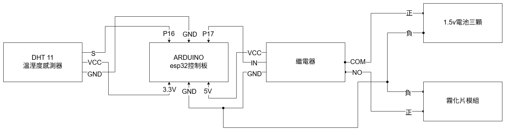
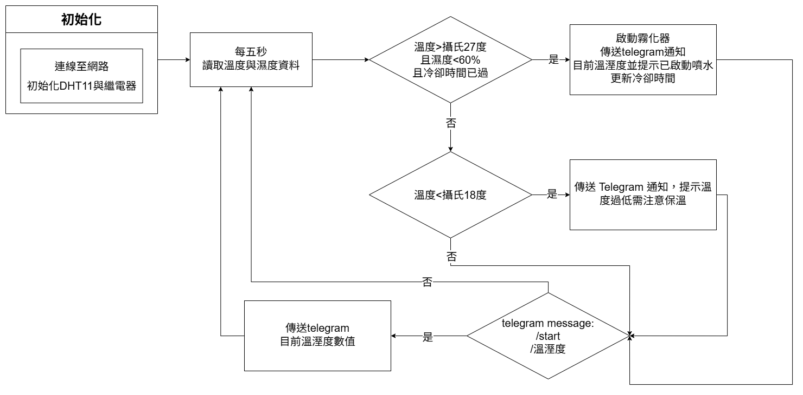

# Electronic-and-Electric-Circuits
# Arduino 溫溼度自動控制霧化系統

## 研究目的

- 設計一個能自動判斷環境變化的控制系統
- 根據「溫度過高且濕度不足」的條件，自動開啟霧化片
- 加入計時機制，避免裝置頻繁啟動
- 提供即時數據監控（搭配 Telegram 互動）

## 使用元件

- Arduino esp32
- 霧化元件+驅動板
- DHT11溫溼度感測器
- 三號電池三顆
- 電池盒
- 繼電器
- 裝水容器
- 杜邦線、電源線、麵包板

## 硬體接法

## 控制邏輯

## Telegram 互動功能

- 傳送 `/start` 指令可啟動機器人並獲得操作說明
- 傳送「溫溼度」可即時查詢目前感測數據
